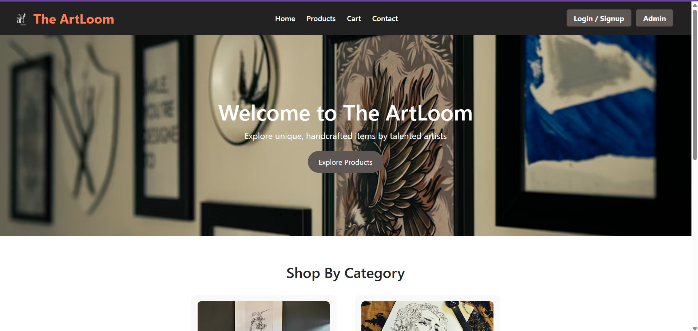
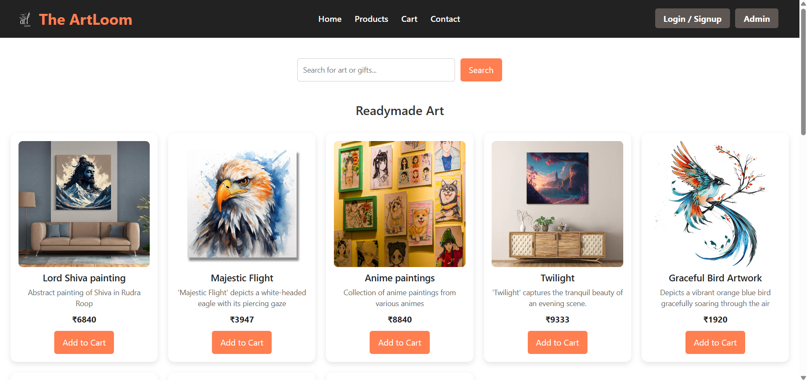
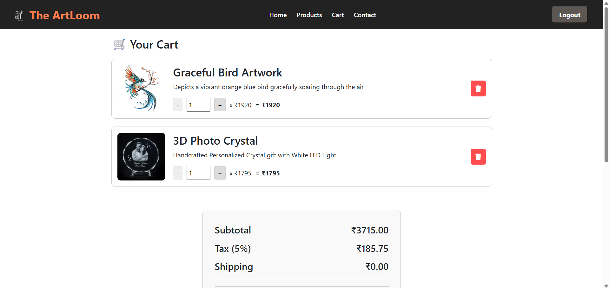
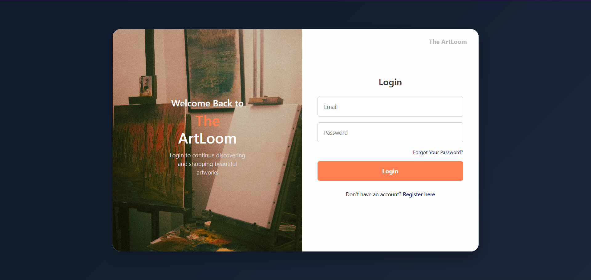
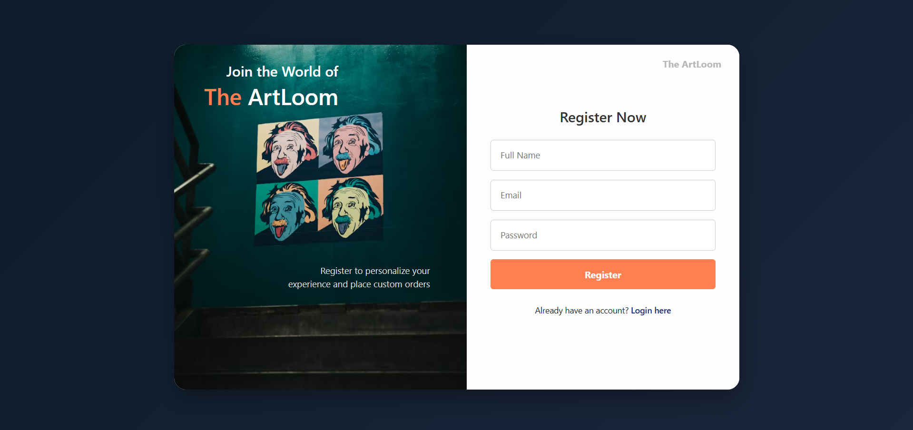
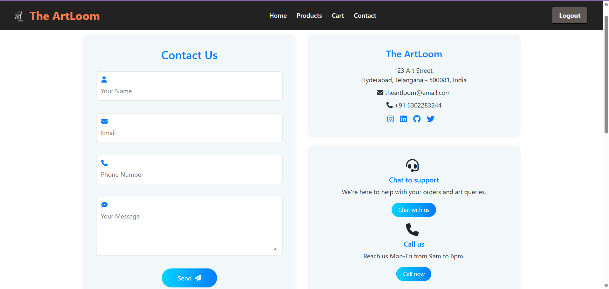

# The ArtLoom - E-commerce Application

---

## Table of Contents

* [About The ArtLoom](#about-the-artloom)
* [Features](#features)
* [Technologies Used](#technologies-used)
* [Project Structure](#project-structure)
* [API Endpoints](#api-endpoints)
* [Getting Started](#getting-started)
    * [Prerequisites](#prerequisites)
    * [Backend Setup](#backend-setup)
    * [Frontend Setup](#frontend-setup)
* [Screenshots](#screenshots)
* [Database Schema (Optional)](#database-schema-optional)
* [Contributing](#contributing)
* [License](#license)

  ---

## About The ArtLoom

The ArtLoom is a comprehensive e-commerce platform designed to provide a seamless shopping experience for users to browse products, manage their carts, and more. This application is built with a robust Spring Boot backend for handling business logic and API services, and a dynamic Angular frontend for an interactive user interface. All APIs have been rigorously tested using Postman.

---
## Features

* **User Management:** Register, login, update, and delete user profiles.
* **Product Catalog:** Browse a wide range of products, view details, and manage product listings (for admin/privileged users).
* **Shopping Cart:** Add, remove, and update quantities of items in the shopping cart.
* **Contact Form:** Users can send messages through a contact form.
* **Image Upload:** Backend support for uploading product images.
* **Authentication:** Secure user login and authorization (implied by login API).
* **Responsive Design:** (If your Angular app is responsive) A user-friendly interface that adapts to various screen sizes.

## Technologies Used

### Backend
* **Spring Boot:** Framework for building the RESTful API.
* **Java:** Programming language.
* **MySQL:** Relational database for data storage.
* **Maven:** Dependency management and build automation tool.
* **Jakarta Validation:** For API request body validation.

### Frontend
* **Angular:** Framework for building the single-page application.
* **TypeScript:** Programming language for Angular development.
* **HTML5:** Structure of the web pages.
* **CSS3:** Styling and layout.

### Tools
* **VS Code:** Integrated Development Environment.
* **Postman:** For API testing.
* **Git:** Version control.
* **GitHub:** Code hosting.

  ---

## Project Structure

This section outlines the directory structure of the ArtLoom project, separated into Frontend and Backend components.

```
├── BACKEND/
│   ├── .angular/
│   ├── .mvn/
│   ├── .vscode/
│   ├── node_modules/
│   ├── src/
│   │   ├── main/
│   │   │   └── java/
│   │   │       └── com/
│   │   │           └── example/
│   │   │               └── ArtLoom/
│   │   │                   ├── config/
│   │   │                   │   ├── CorsConfig.java
│   │   │                   │   ├── SecurityConfig.java
│   │   │                   │   └── WebConfig.java
│   │   │                   ├── controller/
│   │   │                   │   └── ArtLoomController.java
│   │   │                   ├── dto/
│   │   │                   │   ├── CartItemDTO.java
│   │   │                   │   ├── LoginDTO.java
│   │   │                   │   ├── RegisterDTO.java
│   │   │                   │   └── UpdateQuantityDTO.java
│   │   │                   ├── model/
│   │   │                   │   ├── CartItemModel.java
│   │   │                   │   ├── CartModel.java
│   │   │                   │   ├── ContactMessageModel.java
│   │   │                   │   ├── ProductModel.java
│   │   │                   │   └── UserModel.java
│   │   │                   ├── repository/
│   │   │                   │   ├── CartItemRepository.java
│   │   │                   │   ├── CartRepository.java
│   │   │                   │   ├── ContactMessageRepository.java
│   │   │                   │   ├── ProductRepository.java
│   │   │                   │   └── UserRepository.java
│   │   │                   └── service/
│   │   │                       ├── ArtLoomApplication.java
│   │   │                       └── ArtLoomService.java
│   │   ├── resources/
│   │   ├── test/
│   │   └── uploads/
│   ├── .editorconfig
│   ├── .gitattributes
│   ├── .gitignore
│   ├── angular.json
│   ├── HELP.md
│   ├── mvnw
│   ├── mvnw.cmd
│   ├── package-lock.json
│   ├── package.json
│   ├── pom.xml
│   ├── README.md
│   └── tsconfig.app.json
│
└── FRONTEND/
├── .angular/
├── .vscode/
├── node_modules/
├── public/
├── src/
│   ├── app/
│   │   ├── Admin/
│   │   │   ├── admin-home/
│   │   │   ├── admin-login/
│   │   │   ├── admin-products/
│   │   │   ├── admin-auth-service.ts
│   │   │   ├── admin-auth.spec.ts
│   │   │   ├── admin-auth.ts
│   │   │   ├── admin-guard.spec.ts
│   │   │   └── admin-guard.ts
│   │   ├── home/
│   │   │   ├── home.spec.ts
│   │   │   └── home.ts
│   │   ├── login/
│   │   │   ├── login.css
│   │   │   ├── login.html
│   │   │   ├── login.spec.ts
│   │   │   └── login.ts
│   │   ├── products/
│   │   │   ├── products.css
│   │   │   ├── products.html
│   │   │   ├── products.spec.ts
│   │   │   └── products.ts
│   │   ├── signup/
│   │   │   ├── signup.css
│   │   │   ├── signup.html
│   │   │   ├── signup.spec.ts
│   │   │   └── signup.ts
│   │   ├── Pages/
│   │   │   ├── cartComponent/
│   │   │   │   ├── cart.css
│   │   │   │   ├── cart.html
│   │   │   │   ├── cart.service.ts
│   │   │   │   ├── cart.spec.ts
│   │   │   │   └── cart.ts
│   │   │   └── contact/
│   │   │       ├── contact.css
│   │   │       ├── contact.html
│   │   │       ├── contact.spec.ts
│   │   │       └── contact.ts
│   │   └── ReusableComponents/
│   │       ├── footer/
│   │       │   ├── footer.css
│   │       │   ├── footer.html
│   │       │   ├── footer.spec.ts
│   │       │   └── footer.ts
│   │       └── navbar/
│   │           ├── navbar.css
│   │           ├── navbar.html
│   │           ├── navbar.spec.ts
│   │           └── navbar.ts
│   ├── assets/
│   ├── app.config.server.ts
│   ├── app.config.ts
│   ├── app.css
│   ├── app.html
│   ├── app.routes.server.ts
│   ├── app.routes.ts
│   ├── app.spec.ts
│   ├── app.ts
│   ├── auth-guard.spec.ts
│   ├── auth-guard.ts
│   ├── data-service.spec.ts
│   ├── data-service.ts
│   ├── index.html
│   ├── main.server.ts
│   ├── main.ts
│   ├── server.ts
│   └── styles.css
├── .editorconfig
├── .gitignore
├── angular.json
├── package-lock.json
├── package.json
├── README.md
├── tsconfig.app.json
├── tsconfig.json
└── tsconfig.spec.json
```
---
## API Endpoints

The following are the main API endpoints provided by the Spring Boot backend, handled by `ArtLoomController.java`.

### General
* `GET /` - Returns a test message ("Hi I'm up and running").

### User Management
* `GET /users` - Retrieve a list of all users.
* `GET /users/{id}` - Retrieve a user by their ID.
* `PUT /users/{id}` - Update an existing user's details.
* `DELETE /users/{id}` - Delete a user by their ID.
* `POST /register` - Register a new user with `RegisterDTO`.
* `POST /login` - Authenticate a user with `LoginDTO`, returns JWT or success message.

### Product Management
* `POST /products` - Add a new product.
* `GET /products` - Retrieve a list of all products.
* `GET /products/{id}` - Retrieve a product by its ID.
* `PUT /products/{id}` - Update an existing product's details.
* `DELETE /products/{id}` - Delete a product by its ID.

### Cart Management
* `GET /cart` - Retrieve a list of all carts.
* `GET /cart/{id}` - Retrieve a cart by its ID.
* `PUT /cart/{id}` - Update an existing cart's details.
* `DELETE /cart/{id}` - Delete a cart by its ID.
* `GET /cart/user/{userId}` - Get the cart ID for a specific user.

### Cart Item Management
* `POST /cartitem` - Add a list of cart items using `CartItemDTO`.
* `GET /cartitem` - Retrieve a list of all cart items.
* `GET /cartitem/{id}` - Retrieve a cart item by its ID.
* `PUT /cartitem/{id}` - Update an existing cart item's details.
* `DELETE /cartitem/{id}` - Delete a cart item by its ID.
* `GET /cartitem/cart/{cartId}` - Get all cart items for a specific cart.
* `PATCH /cartitem/{id}/quantity` - Update the quantity of a cart item by its ID.

### Other
* `POST /upload` - Upload an image file.
* `POST /contact` - Submit a contact message.
* `GET /contact` - Retrieve all contact messages.
---
## Getting Started

Follow these instructions to set up and run the ArtLoom application on your local machine.

### Prerequisites

Make sure you have the following installed:

* **Java Development Kit (JDK) 17 or higher**
* **Apache Maven 3.x**
* **Node.js (LTS version recommended)**
* **npm (Node Package Manager) - usually comes with Node.js**
* **Angular CLI (`npm install -g @angular/cli`)**
* **MySQL Server**
* **Git**

### Backend Setup

1.  **Clone the repository:**
    ```bash
    git clone [https://github.com/your-username/ArtLoom.git](https://github.com/your-username/ArtLoom.git)
    cd ArtLoom/BACKEND
    ```

2.  **Database Configuration:**
    * Create a MySQL database named `artloom_db` (or whatever you prefer).
    * Update the `src/main/resources/application.properties` file with your MySQL database credentials:
        ```properties
        spring.datasource.url=jdbc:mysql://localhost:3306/artloom_db?useSSL=false&serverTimezone=UTC
        spring.datasource.username=your_mysql_username
        spring.datasource.password=your_mysql_password
        spring.jpa.hibernate.ddl-auto=update # or create, update, create-drop
        spring.jpa.show-sql=true
        ```

3.  **Build the project:**
    ```bash
    mvn clean install
    ```

4.  **Run the Spring Boot application:**
    ```bash
    mvn spring-boot:run
    ```
    The backend server will start on `http://localhost:8080` (or your configured port).
---

### Frontend Setup

1.  **Navigate to the frontend directory:**
    ```bash
    cd ../FRONTEND
    ```

2.  **Install dependencies:**
    ```bash
    npm install
    ```

3.  **Start the Angular development server:**
    ```bash
    ng serve --open
    ```
    This will open the application in your default browser at `http://localhost:4200`.
   ---

## Screenshots

Here are some screenshots of the ArtLoom application in action.

* **Homepage:**
    

* **Product Listing:**
    

* **Shopping Cart:**
    

* **Login Page:**
    

* **Registration Page:**
    

* **Contact Form:**
    

  ---

## Contributing

We welcome contributions! If you'd like to contribute, please follow these steps:

1.  Fork the repository.
2.  Create a new branch (`git checkout -b feature/your-feature-name`).
3.  Make your changes.
4.  Commit your changes (`git commit -m 'Add new feature'`).
5.  Push to the branch (`git push origin feature/your-feature-name`).
6.  Open a Pull Request.

---

## 🧑‍💻 Author

**Sai Veerendra Kotipalli**

- 📧 Email: [saiveerendrakotipalli@gmail.com](mailto:saiveerendrakotipalli@gmail.com)
- 💼 LinkedIn: [www.linkedin.com/in/sai-veerendra-kotipalli-31969b247](https://www.linkedin.com/in/sai-veerendra-kotipalli-31969b247/)
- 🐙 GitHub: [@Sai-Veerendra](https://github.com/Sai-Veerendra)
